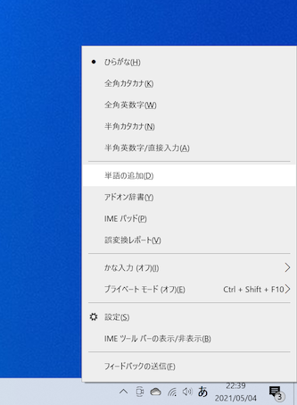
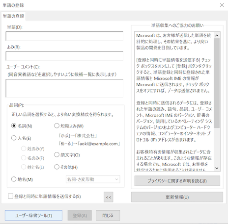
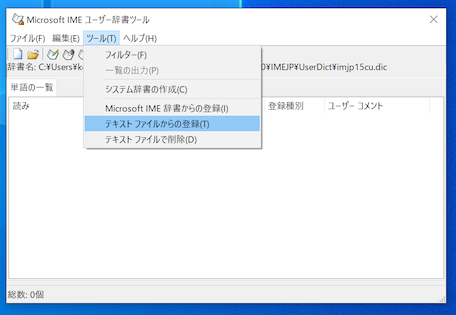
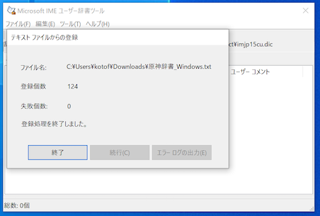
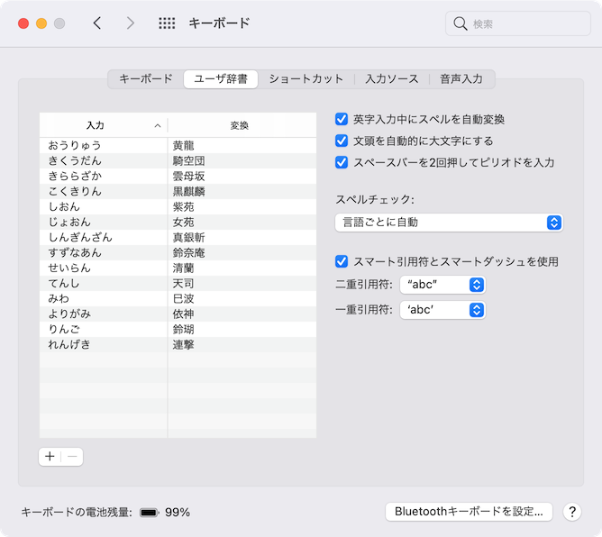
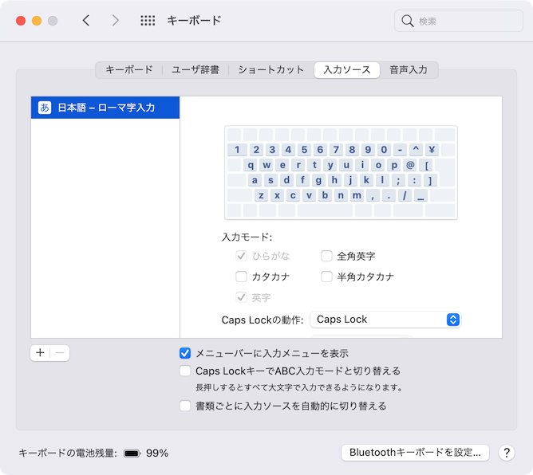
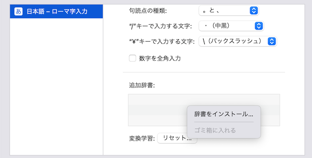

# 原神辞書（Windows/macOS）

[原神](https://genshin.hoyoverse.com/ja/home)の日本語入力用辞書です。
人名、地名、装備名などをカバーしています。

## 登録データ

登録データについては[登録単語の一覧](./docs/dict_data.md)をご覧ください。

## ダウンロード

以下のページより `genshin-dictionary.zip` をダウンロードしてください。
zipファイルを展開するとそれぞれの環境用のファイルが入っています。

https://github.com/kotofurumiya/genshin-dict/releases/latest

## 対応IME

| IME             | 対応ファイル                     | 備考                           |
|----------------:|:-------------------------------|:------------------------------|
| Windows標準      | 原神辞書_Windows.txt            |                               |
| macOSユーザ辞書   | 原神辞書_macOS_ユーザ辞書.plist   |                               |
| macOS追加辞書     | 原神辞書_macOS.txt              |                               |
| iPhoneユーザ辞書  |                                | mac経由で追加可能（後述）         |
| Google IME      | 原神辞書_Windows.txt            | macでもWindows用ファイルで追加可能 |
| SKK | SKK-JISYO.genshin            | SKK辞書 |

## 利用方法（Windows）

タスクバーの右のほうにあるIMEアイコンを右クリックします。
IMEアイコンは「A」とか「あ」みたいな表示になっていると思います。

「単語の追加」を選びます。

単語の登録ウィンドウが開くので、左下の「ユーザ辞書ツール」をクリックします。

ユーザ辞書ツールが開くので、「ツール」から「テキストファイルからの登録」を選びます。
ここでダウンロードしたファイルの中にある「原神辞書_Windows.txt」を選択します。

あとは自動的に登録されます。

## 利用方法(macOSとiPhoneを同期)

macでは2つの方法で辞書を登録できます。

- ユーザ辞書として扱う
  - 普通の単語登録と同じ
  - ユーザ辞書に単語が大量に並んでしまう
  - iCloud同期ができる（macで登録するとiPhoneでも使える）
- 追加辞書として扱う
  - あとで一括削除できる
  - iCloudで同期できない（iPhoneで使えない）

まずはiPhoneでも同時に使える、ユーザ辞書として扱う方法を紹介します。

macの設定から「キーボード」を開き、「ユーザ辞書」タブを選択します。

ダウンロードしたファイルの中にある「原神辞書_macOS_ユーザ辞書.plist」を左の単語欄にドラッグ＆ドロップします。

これで登録は完了です。

## 利用方法（macOSのみ）

次に追加辞書として扱う方法を紹介します。
この方法では設定がスッキリしますが、iPhoneと同期できません。

macの設定から「キーボード」を開き、「入力ソース」タブを選択します。

左から「日本語」を選びそのまま下にスクロールすると「追加辞書」という項目が見えます。

右クリックして「辞書をインストール」を選んで、ダウンロードしたファイルの中にある「原神辞書_macOS.txt」を選択します。

これで辞書が利用できるはずです。

## トラブルシューティング

### うまく変換できない

登録したばかりだと優先度が低めだったりで、変換候補としてなかなか出てこなかったりします。
何度も使って学習させましょう。

また単語区切りも適切でないことがあります。「岩王帝君」を変換しようとして「ガン王弟くん」のようになったり……。
この場合は変換しながらShiftキーを押しつつ矢印キーの左右で変換範囲を変えることができるので、うまく調整してみてください。

### iPhone / Androidで使える？

iPhoneはmacOSで同じAppleIDでログインして、ユーザ辞書として登録すれば同期されます。
iPhone単独で一括登録する方法は無さそうです。

Androidはあんまりわかってないです……。手元にPixel4 XLはあるんですが、開発用に持っているだけなので。

## ライセンス

プログラム部分は[Zlibライセンス](./LICENSE)となります。
Zlibライセンスでは「これは自分が作った」と嘘をつかない限り自由な個人利用・商用利用や改変が認められています。

辞書に含まれる単語はすべてmiHoYoのものとなります。
可能な限り個人的な活用にとどめ、商標などに抵触しない範囲でご利用ください。

## Contributors

- 鍾離先生( https://www.youtube.com/watch?v=0Lp5wBSXLMM )
- 古都こと( https://twitter.com/kfurumiya )